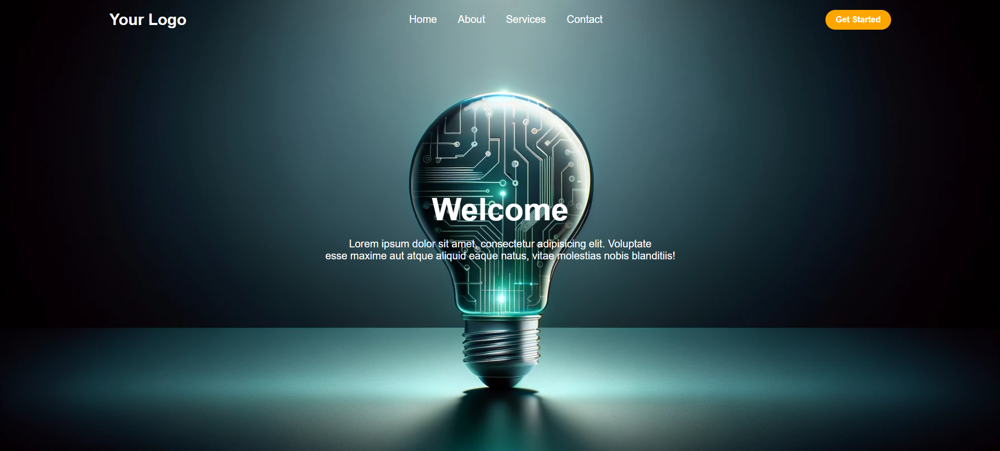

# Responsive Navigation Bar Using HTML and CSS

## Description  
This project is a simple and **responsive navigation bar** built with HTML and CSS. It adapts to various screen sizes, ensuring smooth navigation on both desktop and mobile devices.

## Features  
- **Fully Responsive Design**: Adjusts to all screen sizes.  
- **Clean and Modern UI**: Minimalistic and easy to integrate.  
- **Dropdown Menus**: Dropdown navigation bar on smaller screens
- **Easy to Customize**: Code is well-structured for quick modifications.  

## Technologies Used
The project is built using:
**HTML**,
**CSS**

## Screenshots  
### Desktop View  

### Mobile View  

